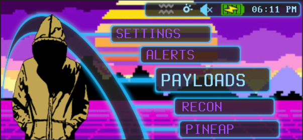

# VaporHax Theme

This is a futuristic Vaporwave Theme created for the Pineapple Pager (Firmware version : 1.0.4).  I have tried to tie every inch of the interface into just two colors. Purple, and Aqua (with a touch of peaks' pink pager) complete with backgrounds and interface elements.

## Key Points

 - Vaporwave backgrounds.
 - Purple and Aqua aesthetic.
 - New keyboards, dialog boxes, menus, spinner, boot animation, buttons etc..
 - Easy read main-menu.

> This is a work in progress. As is everything, always :)

*Made by beigeworm* : https://github.com/beigeworm
