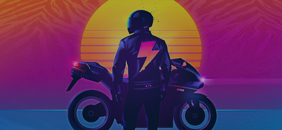

# Neon Biker Theme

An 80s synthwave/retrowave theme for the WiFi Pineapple Pager featuring neon colors, grid landscapes, and a cyberpunk aesthetic.



## ⚠️ Work in Progress

**This is my first theme project!** I'm actively learning and building this out, so consider this an early-stage release. Feedback and suggestions are welcome.

I started by studying the original **wargames** theme to understand how Pager themes work, then customized it with my own synthwave/neon aesthetic. Big thanks to Hak5 for making the theme system accessible to learn from.

## Features

- 🎨 Hot pink and cyan neon color palette
- 🌆 Synthwave grid backgrounds on all screens
- 🔋 Custom speedometer-style battery indicator
- 🖥️ Retro boot animation with loading bar
- ✨ Cyberpunk aesthetic throughout UI

## Color Palette

| Color | RGB | Hex | Usage |
|-------|-----|-----|-------|
| Cyan | 0, 255, 255 | `#00FFFF` | Primary accent |
| Magenta | 255, 20, 147 | `#FF1493` | Highlights |
| Purple | 148, 0, 211 | `#9400D3` | Tertiary accent |
| Blue | 0, 200, 255 | `#00C8FF` | Secondary accent |
| Green | 0, 255, 150 | `#00FF96` | Success states |
| Red | 255, 50, 100 | `#FF3264` | Alerts, danger |
| Yellow | 255, 255, 100 | `#FFFF64` | Warnings |
| Black | 10, 10, 20 | `#0A0A14` | Background |

## Installation

1. Copy the `neon-biker` folder to `/root/themes/` on your Pager
2. Go to **Settings → Display → Theme**
3. Select **neon-biker**

Or via SSH:
```bash
scp -r neon-biker root@172.16.52.1:/root/themes/
```

## Known Issues

- Dashboard icon backgrounds may need refinement (using circular neon rings)
- Some screens still being customized

## Roadmap

- [ ] Custom menu icons with neon glow
- [ ] Improved battery indicator animations
- [ ] More synthwave background variations
- [ ] Custom alert sounds (synthwave tones)

## Credits

- **Author:** [ZeroDayTrail](https://github.com/ZeroDayTrail)
- **Based on:** The original wargames theme by Hak5
- **Inspiration:** Synthwave/outrun aesthetic, 80s neon culture

## Compatibility

- **Firmware Version:** Developed for WiFi Pineapple Pager firmware 1.x
- **Theme Framework Version:** 0.5

## License

MIT License - Feel free to use and modify!
